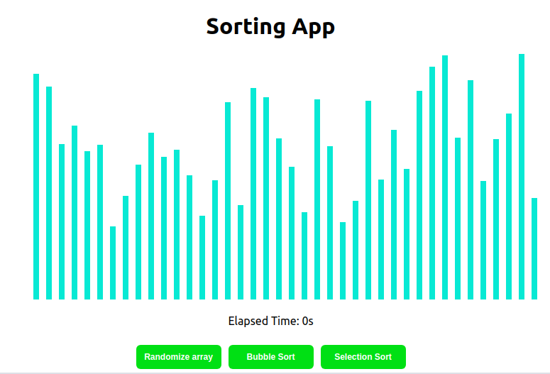

# slashsort

Simple sorting algorithms viewer app. 

Check it ---> https://mmendesas.github.io/slashsort/

  
Just play around with some algorithms

  

## How to test this implementation

In the project directory, you can run:

- `yarn`: Intalling dependencies
- `yarn start` : Start in development mode

Runs the app in the development mode. 
Open [http://localhost:3000](http://localhost:3000) to view it in the browser.

## Built With

- [Reactjs](https://reactjs.org/) - A javascript library for building user interfaces

## Author

- **Marcio Mendes** - [mmendesas](https://github.com/mmendesas)